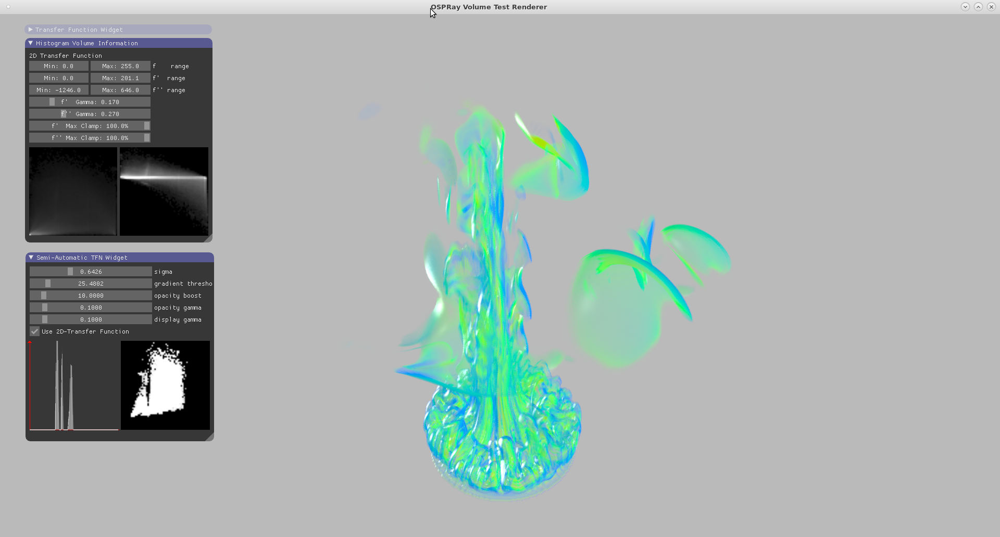
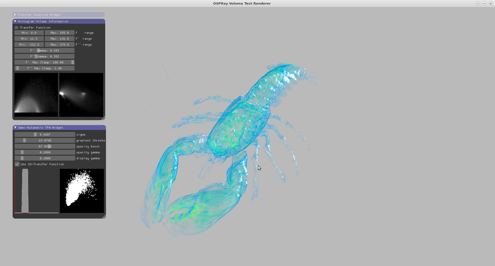

# Semi-Automatic Transfer Function Generation #

![alt text][teaser]
*Teaser Semi-Automatic Classification of *Tooth* Dataset using 2D Transfer Function*

## Introduction ##

In 1998, Gordon Kindlmann introduced a semi-automatic method to generate 1D or 2D transfer functions for boundary visualization using direct volume rendering. his paper took the advantages of 1st and 2nd order gradients of a volumetric data to classify the position of boundary areas. In this final project, I implemented his idea using OSPRay.
 
## Implementation ##
### 2D Transfer Function in OSPRay ###

I implemented a 2D transfer function widget inside OSPRay. Originally OSPRay considers transfer function only as one of the properties in volume, which means any transfer function must be owned by one or several volumes. During the rendering process, OSPRay queries the emission and absorption value using the sampled scalar value only. This method simplifies the implementation of a 1D transfer function, but limits the developments of multivariate transfer functions because the transfer function cannot read other volumetric information through the existing class abstraction.

To fix the problem, I changed the way of thinking. Instead of attaching a transfer function to any volume, I removed the connections between them. As a result, the renderer need to provide one volume and one sample position to the transfer function each time it needs to calculate the color. It is now the transfer function’s responsibility to sample the volume in a provided position. Of course, a transfer function can choose to sample one or more variables depends on its implementation.

![alt text][figure1]
*Figure 1 An example for configuring the gradient transfer function plugin*

With the help of this modification in core OSPRay, I easily created a gradient transfer function plugin using OSPRay API. This plugin works for all types of volumes exist in current OSPRay. Users can easily configure the new transfer function using OSPRay API calls as well. An example is provided in Figure 1

### Semi-Automatic Classification using Histogram Volume ###

In Gordon’s paper, a histogram volume was used for inspecting the boundary condition. The histogram is simple a 3D histogram
) which computes the appearing frequency of value ) inside a volume. According to his paper, the first order gradient was calculated by the magnitude of volume gradient  and the second order gradient was computed using Laplacian 

)

To classify the boundary region, we need to first compute an approximate position function:

=-\frac{\sigma^2%20h(v)}{max(g(v)-g_{threshold},0)})


=-\frac{\sigma^2%20h(v,g)}{max(g-g_{threshold},0)})

This position function characterizes the approximate distance between the current sample point ) and the nearest boundary center. To convert the distance into an opacity value, we need to also define an opacity function which assigns opacity value to different distance values. In my implementation I used a simple triangle function with an adjustable scale as the opacity function. Certainly, we can easily implement a more sophisticated user-interface to adjust this function. I didn’t do it simply due to the time limitation. Figure 2 shows the difference between 1D classification and 2D classification. In this example, an identical position function was used. It is obvious that 2D transfer function is better in extracting sophisticated regions. In my implementation, many processes (e.g. calculating gradients and the histogram) are parallelized using Intel TBB.

![alt text][figure2]
*Comparison between 1D (left) and 2D (middle) transfer function. Both transfer functions are generated using the same distance function. We can see that 2D transfer function can provide a more complicated selection. The corresponding histograms and generated transfer functions are provided also (right). The upper two small pictures are scatter plots of f' versus f (upper left) and f'' versus f (upper right). The lower two small pictures display the generated 1D (lower left) and 2D (lower right) transfer functions.*

### Transfer Function Widgets using ImGui (Compatible to OSPRay) ###

To really make the volume viewer working, I implemented also several GUI widgets using immediate mode GUI. Currently OSPRay is using the same GUI library inside its example viewer, which means my implementation can be easily imported into OSPRay without breaking any existing functionalities. There are three widgets in my program: a traditional 1D transfer function widget used to create a color palette (right figure in Figure 3); a histogram volume inspector which shows projected images from two axes f versus f' and f versus f'' (middle figure in Figure 3); a semi-automatic transfer function widget which generates an either 1D or 2D opacity map for OSPRay renderer.

![alt text][figure3]
*Three widgets implemented using immediate mode GUI. Left image shows the semi-automaticaly generated 1D and 2D transfer functions, with some adjustable parameters that one can change. The middle images shows the histogram volume inspection, which has also some parameters to adjust the display including the min/max and the gamma correction value. The rigth image shows a conventional 1D  transfer function widgets with movable control points and color editors. The transfer function color in my program is controlled by this widget.*

## Unimplemented Features ##
Because of the limited time I had for this project, there are some features that I failed to finish. Firstly, the widget to customize an opacity function was not implemented, therefore currently we can only modify the overall intensity of the opacity map being generated while we cannot change the overall shape of this function.  Secondly, I failed to implement the user-interface for plotting colors on the 2D opacity map. It is important to implement it since any users who is using the 2D opacity widget would intuitively want a color plotter in 2D coupled with it.

## Future Work ## 

In additional to the unimplemented features before, there are still more possible works we can do for this project.  For example, we can implement a transfer function reader which accepts file formats coming from popular production software such as ParaView and VisIt. This can help users to generate nice images rapidly via OSPRay using transfer functions they created inside production software, which provides a way more efficient UI. 

## How to Compile ##

The program requires OpenGL 4+ with 3D texture support. I don't recommend running it on Mac. I have tested it on Linux (Ubuntu and CentOS 7) machines. [Need a Linux ?](HELPME.md)

```
mkdir build
cd build
cmake .. -DCMAKE_BUILD_TYPE=Release
make -j8
```

## How to Run ##

```
cd build
./viewer_raycast ../data/neghip.json
```

## How to control it ##

Use left mouse click to rotate 

Use right mouse click to zoom.

## Operate ImGui ##

* Left click and drag anywhere on the widget to move the wiget position.

* Double left click the witget top bar to collapse the widget.

* Left click and drag the botton right triangle to resize the widget.

* For a Min/Max range control, left click and drag on any rectangle to change its value. 

* For a slider, left click and drag to slider to change the value.

## Operate 1D transfer function ##

* Left click drag gray dots to adjust control color/opacity points.

* Double right click gray dots to adjust control color/opacity points.

* Double left click on empty area to add new control points.

* Left click on the color squares to change color a color.

## Operate the semi-automatic transfer function widget ##

* Adjust gradient threshold and the sigma value can usually create a good image.

* If the image looks very transparent, try to increase the opacity boost value.

* Use the opacity gamma slider to adjust the gamma correction applied to the actual opacity map.

* Use the display gamma slider to adjust the gamma correction applied to the displayed opacity map (this will not affect the rendering at all).

## Rendered Images ##

See assets folder







[teaser]: assets/report/Teaser.png "Semi-Automatic Classification of Tooth Dataset using 2D Transfer Function"
[figure1]: assets/report/Figure1.png "An example for configuring the gradient transfer function plugin" 
[figure2]: assets/report/Figure2.png "Comparison between 1D and 2D transfer function" 
[figure3]: assets/report/Figure3.png "Three widgets implemented using immediate mode GUI" 
