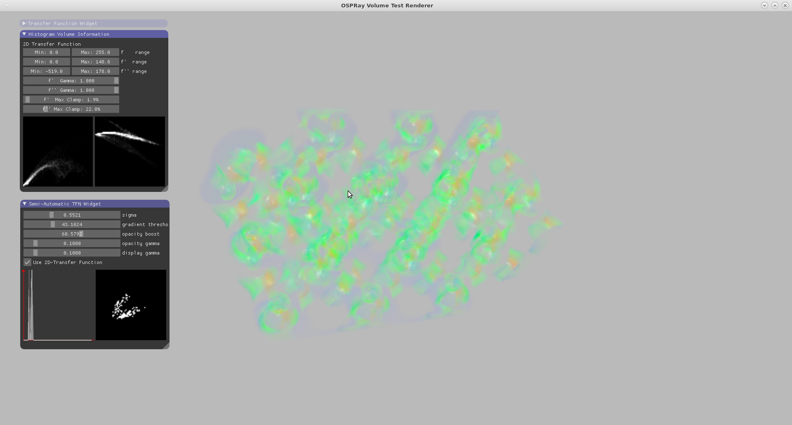
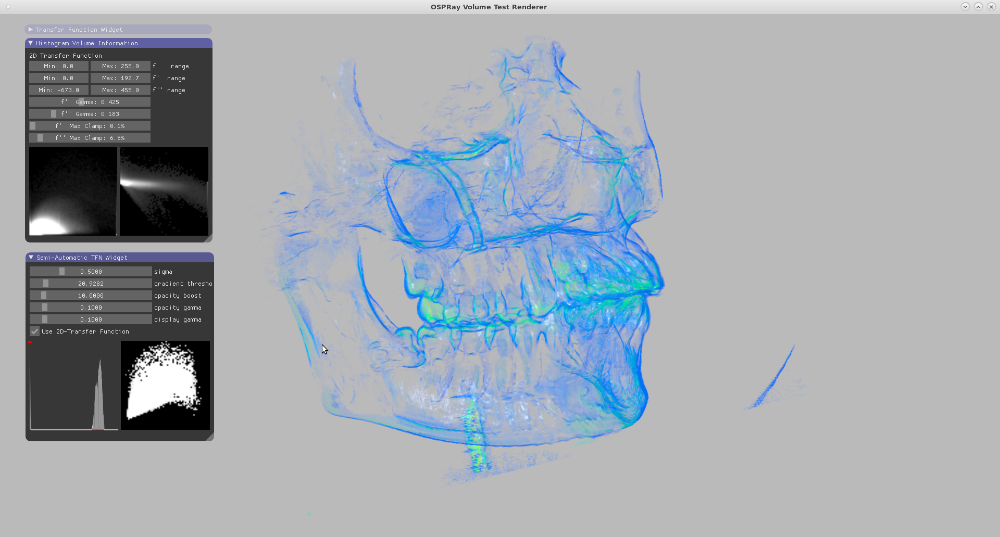

# Semi-Automatic Transfer Function Generation #

## How to Compile ##

The program requires OpenGL 4+ with 3D texture support. I don't recommend running it on Mac. I have tested it on Linux (Ubuntu and CentOS 7) machines. [Need a Linux ?](HELPME.md)

```
mkdir build
cd build
cmake .. -DCMAKE_BUILD_TYPE=Release
make -j8
```

## How to Run ##

```
cd build
./viewer_raycast ../data/neghip.json
```

## How to control it ##

Use left mouse click to rotate 

Use right mouse click to zoom.

## Operate ImGui ##

* Left click and drag anywhere on the widget to move the wiget position.

* Double left click the witget top bar to collapse the widget.

* Left click and drag the botton right triangle to resize the widget.

* For a Min/Max range control, left click and drag on any rectangle to change its value. 

* For a slider, left click and drag to slider to change the value.

## Operate 1D transfer function ##

* Left click drag gray dots to adjust control color/opacity points.

* Double right click gray dots to adjust control color/opacity points.

* Double left click on empty area to add new control points.

* Left click on the color squares to change color a color.

## Operate the semi-automatic transfer function widget ##

* Adjust gradient threshold and the sigma value can usually create a good image.

* If the image looks very transparent, try to increase the opacity boost value.

* Use the opacity gamma slider to adjust the gamma correction applied to the actual opacity map.

* Use the display gamma slider to adjust the gamma correction applied to the displayed opacity map (this will not affect the rendering at all).

## Rendered Images ##

See assets folder





