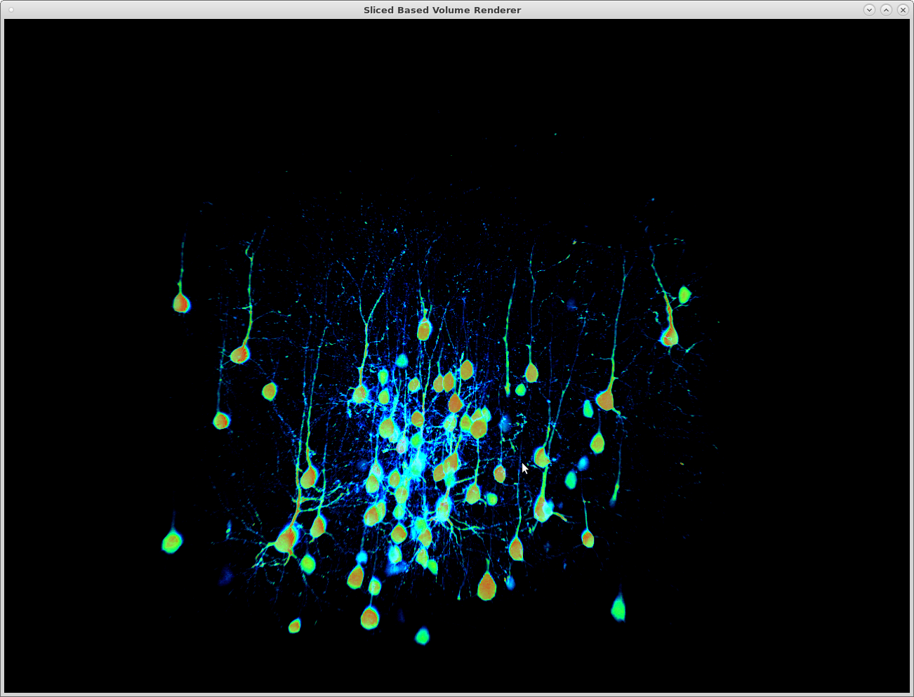

# Slice Based Volume Renderer #

## How you solved this assignment ##

I implemented the sliced based renderer by using two framebuffer objects.

For each iteration:

1. Determine the depth of the current slice we are going to render.

2. Compute vertices of the proxy geometry using a plane-box intersection.

3. Sort the vertices in counter-clockwise order to form a [TRIANGLE_FAN](https://en.wikipedia.org/wiki/Triangle_fan)

4. Render the TRIANGLE_FAN with one framebuffer as input texture, the other one
as rendering target

5. Inside the shader, the program computes the color of each fragment, and then compose
(back-to-front) the rendered color with the accumulated color read from the texture. 
The composed color will be written to the second framebuffer obejct

6. Once everything is done, the program will swap the two framebuffers and start a new
iteration until we finish all slices.

## What resources you used ##

I used GLM and GLFW internally, I used their sample program to setup 3D textures in
OpenGL. I implemented the algorithm based on the descriptions from GPU-Gem online.

## Any known bugs in your assignment ##

* Although I implemented opacity correction, but I noticed that the final color will
still change if I change the number of slices to be rendered. This bug didn't showup
in the second assignment.

* My renderer can load [NEGHIP](data/neghip.json) dataset correctly, 
but it cannot read [CSAFE](data/csafe_heptane.json) dataset properly for some readons.

## How to Compile ##

The program requires OpenGL 4+ with 3D texture support. I don't recommend running it 
on Mac. I have tested it on Linux (Ubuntu and CentOS 7) machines. 

```
mkdir build
cd build
cmake .. -DCMAKE_BUILD_TYPE=Release
make -j8
```

## How to Run ##

```
cd build
./viewer_slice ../data/neghip.json
```

## How to control it ##

Use left mouse click to rotate. 

Use right mouse click to zoom.

## Rendered Images ##

See the assets folder




